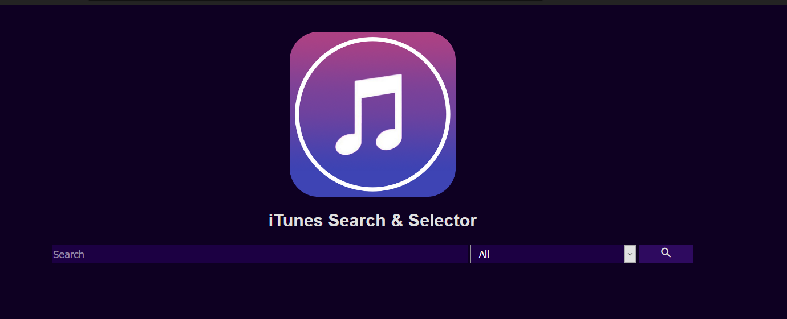
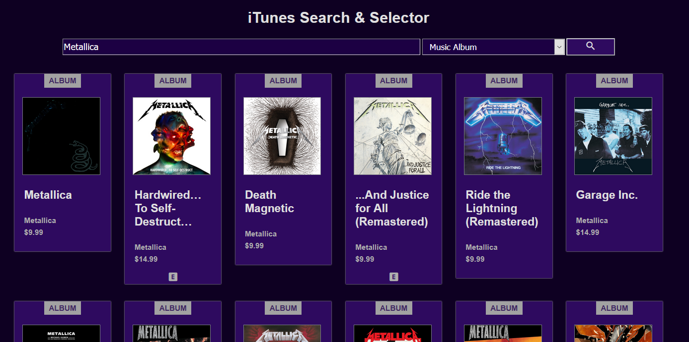

# iTunes Search & Selector

WebApp Project using iTunes search API


## Guide
To search some content type in the searchBar what you're looking for then click the search button.

If you are looking for specific type of content you can select one of the many options available on the dropdown list, these include:

* Movies
* Podcasts
* Music Tracks
* Music Albums
* Music Videos
* AudioBooks
* All



Once you've clicked the search button, a list will be filled with information about the content you're looking for right below.

### Media Cards

These cards contain the following information:

* In the uppermost of the card you can see the type of media it is (Album, podcast, music...).
* In the center artwork from the content will be shown.
* Lists the media name right beneath.
* In case the content is a single track like music, it will also show the album it belongs to (Excludes Collections).
* Price tag for the content available at iTunes (In the case of collections it will show the price of the whole collection).
* At the end depending if the media has sensitive content, a EXPLICIT label will be shown. 




## Project setup

### Run
```
npm install

npm run serve

npm run build
```

### Unit Tests
```
npm run test:unit
```

## Tools Used

* Vue.js
* Mocha + Chai
* HTML
* CSS
* JQuery


## Project Description
Search Page contains 3 values: searchField asociated to the search textInput, searchSelect asociated to the search type dropdownList and generatedURL used by the function getQueryURL. For the icons used (Search button and EXPLICIT tag) Google's library for Material Icons was used.

At the start of the page we got 5 elements these being iTunes icon, application name, search textInput field, media type dropdown list and a search button. The media type dropdown gets it's data from the project store file in /src/store/index.js from the state searchType, this is a array which has 2 elements one used for the text shown on the dropdown list and the other the value that will be used to create the Query URL. 

When pressing the search button, getSearchResult funtion is called where using JQuery it will create the query and send it to the iTunes API generated link, this link is retrieved using the function getQueryURL which will concatenate strings depending on the selected item on the dropdown List; if the 'all' option is selected it will only return a string in the style "https://itunes.apple.com/search?term=" + searchedTerm, but if any other option is selected it will concatenate the string "&entity=" + selectedType and return the generated URL. Once the query is done it will call the function saveSearchResult and pass the recieved data from the API. In this function we start by clearing the searchResults list before iterating through each item in the query and adding them to the array; here there are 3 cases to save the data to the local array due to diferent attibutes on some items, generally we save the following data: id, type of media, artwork link, media name, artist name, price and the explicit tag; some media will also save the collection name it belongs, due to the lower quality of the artwork we got from the query we slightly change the url to request for a higher resolution artwork.

Using Vue.js's v-for function, it iterates on each item of the local array and creates each media card using the item information; depending if the media type doesn't requiere the collection name it will be skiped, also if it isn't EXPLICIT content it won't show the respective label and if the artwork couldn't be loaded a default picture will be placed instead.

Inside the project store file we got 2 list elements, one the already mentioned searchType and the other is the searchResults list, this list is our local save from the results we got from the query, and it will change using mutations and actions in the same file. Actions are used to commit the mutations and these are for clearing the searchResults array and to add new media to the array.

A mockStore was created to be used on unit testing, it contains same elements as the original store but includes content from 2 querys to use with unit tests instead of calling the API.
